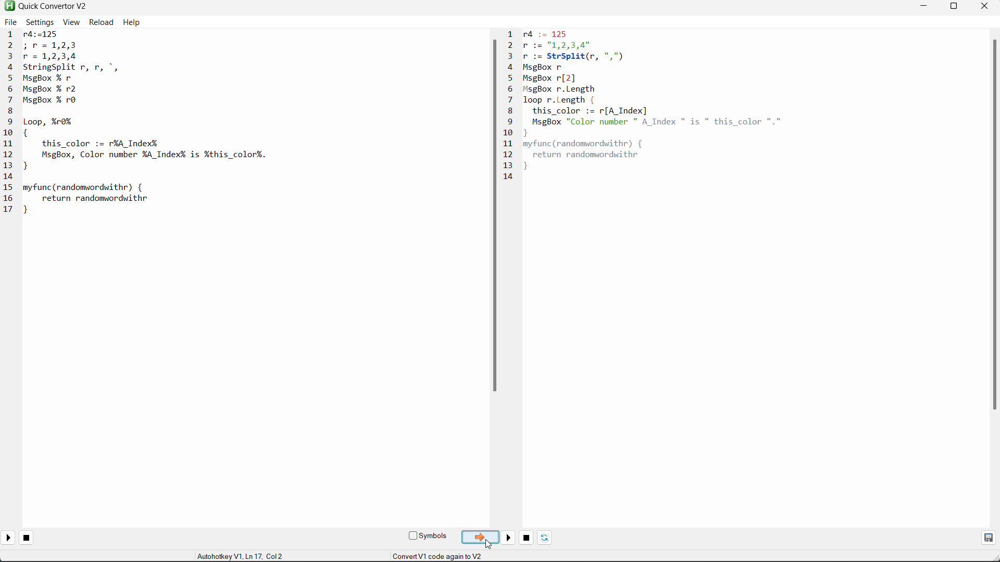

`QuickConvertorV2_scintilla.ah2` gui "stolen" from https://github.com/mmikeww/AHK-v2-script-converter/blob/master/QuickConvertorV2_scintilla.ahk 

___

# How to use

1) download the whole folder: https://github.com/FuPeiJiang/ahk_to_v2.ah2/archive/refs/heads/main.zip 
2) run file `QuickConvertorV2_scintilla.ah2` in AutoHotkey v2 
3) copy paste your text into left hand box and click arrow  